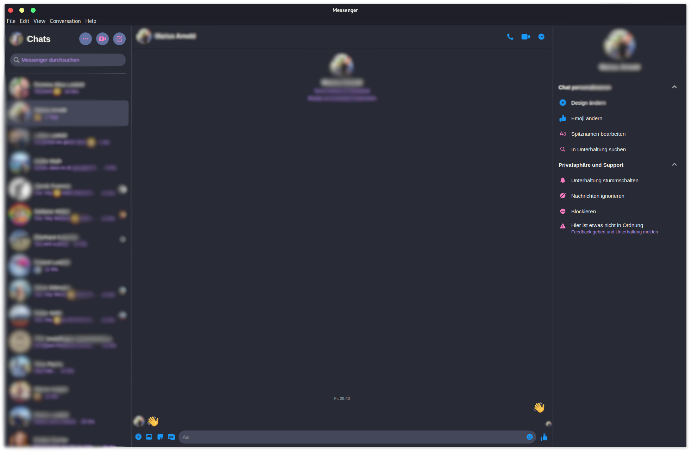

# Dracula for [Caprine Messenger](https://sindresorhus.com/caprine/)

> A dark theme for [Caprine Messenger](https://sindresorhus.com/caprine/).

## Install

All instructions can be found at [draculatheme.com/caprine-messenger](https://draculatheme.com/caprine-messenger).

## Team

This theme is maintained by the following person(s) and a bunch of [awesome contributors](https://github.com/dracula/fabian-pandas/graphs/contributors).

|  |
| --------------------------------------------------------------------------------------------------- |
| [Fabian Pandas](https://github.com/fabian-pandas)                                                   |

## Community

- [Twitter](https://twitter.com/draculatheme) - Best for getting updates about themes and new stuff.
- [GitHub](https://github.com/dracula/dracula-theme/discussions) - Best for asking questions and discussing issues.
- [Discord](https://draculatheme.com/discord-invite) - Best for hanging out with the community.

## Credits

Thanks a lot to [@HugLifeTiZ](https://gist.github.com/HugLifeTiZ), on whose work this css is based.

## License

[MIT License](./LICENSE)
